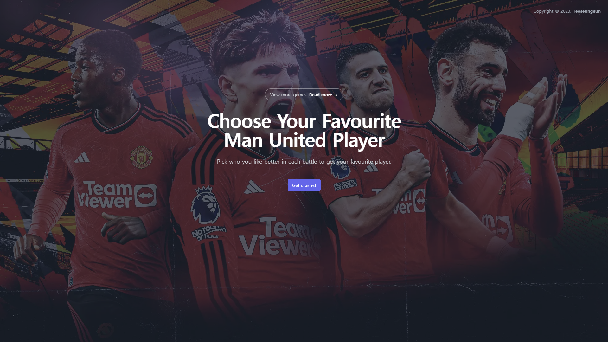
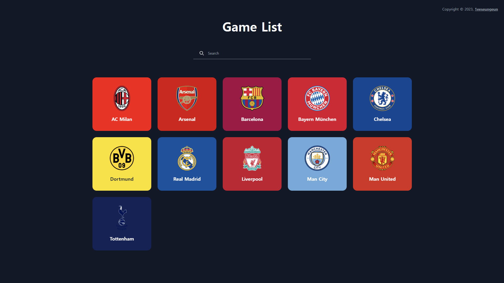
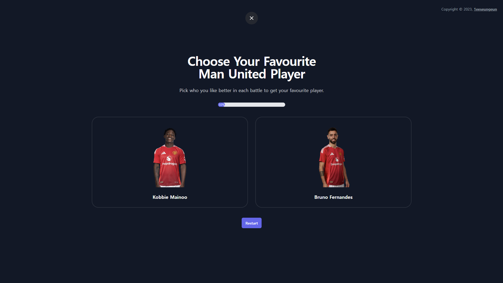
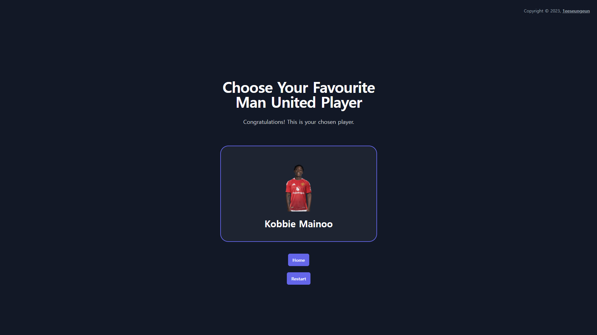

# About The Project

 

  This is a fanmade website to sort your favourite football players of each football teams.
     
    <a href="https://1eeseungeun.github.io/footballersorter/">Game List</a>
  

 

## Built With

* 
* 
* 
* 

 

## Tutorial
1. Select the game you want to play from the game list.

2. Press the "Get Started" button to start the game.

3. Select the player you like.

4. Here comes the result when you finish sorting your favourite player.

 

## License

Distributed under the MIT License. See `LICENSE.md` for more information.

(<a href="#readme-top">back to top</a>)

